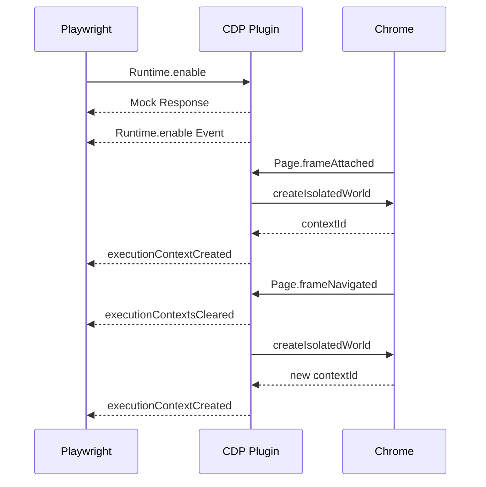

# RFC: Runtime.enable Plugin for CDP Proxy Interceptor

## 1. Overview
This **Request For Comments (RFC)** outlines how to transparently replicate the outcome of the ``src.patch.txt` from rebrowser-patches, mainly **preventing detection of `Runtime.enable`**—using a plugin for the CDP Proxy Interceptor that intercepts and manipulates Chrome DevTools Protocol (CDP) traffic between Playwright and the actual browser.

By design, **Playwright** natively calls `Runtime.enable` for each new page and worker context. Anti-bot scripts often detect that call. The patches in `lib.patch.txt` and `src.patch.txt` remove or defer `Runtime.enable` within Playwright's internals so that websites do not detect the DevTools Runtime domain activation. However, modifying the library is cumbersome to maintain, and can break new versions of Playwright. Instead, we will:

1. **Intercept** the client's `Runtime.enable` requests at the CDP level using the CDP Proxy Interceptor.
2. **Fake** the success responses so Playwright thinks `Runtime.enable` was called.
3. **Manually** create new execution contexts and send the same `Runtime.executionContextCreated` events that Playwright expects—without ever actually enabling the Runtime domain on the real browser endpoint.

Everything happens via a **CDP plugin** that leverages the CDP Proxy Interceptor's plugin system to rewrite requests/responses and inject messages on the wire. **No patches or changes to Playwright itself** are needed.

---

## 2. Technical Objectives

1. **Omit or Filter** any `Runtime.enable` request going from Playwright to the browser.
2. **Send Fake Successful Responses** for `Runtime.enable` so Playwright continues normally.
3. **Create Execution Contexts** by calling `Page.createIsolatedWorld` or `Runtime.addBinding` behind the scenes so that each page/worker obtains the expected `executionContextId`.
4. **Emit Synthetic** `Runtime.executionContextCreated` events so that Playwright believes everything is normal.
5. **Preserve** the rest of the CDP messages (navigation, logging, network, etc.) without disruption.

---

## 3. Mapping to the Original Patches
The original patches remove calls to `Runtime.enable` or gate them behind environment variables, then replace them with manual context creation logic. Our plugin approach replicates that logic in the middle:

1. **Intercept** `Runtime.enable` → **drop** the request, store in memory that the user "wants" it enabled, and send a success response.
2. **Track** frames or workers → whenever we see `Page.frameAttached`, `Page.frameNavigated`, `Target.attachedToTarget`, or worker creation, we proactively create contexts for them (via `Page.createIsolatedWorld`, `Runtime.addBinding`, etc.).
3. **Emit** "`Runtime.executionContextCreated`" events to the client so it thinks the runtime domain is active.

This is effectively the same outcome as the patches, but done externally in the proxy layer.

---

## 4. Exact Modifications Recap
From prior research (and the patch details), to hide `Runtime.enable`:

1. **Skip** the real `Runtime.enable` call to the browser:
   ```typescript
   if (request.method === "Runtime.enable") {
     // Mark that the session wants the runtime domain
     this.sessionsRuntimeEnabled.set(request.sessionId!, true);

     // 1. Send mock response to acknowledge the original request
     const mockResponse: CDPCommandResponse = {
       id: request.id,
       result: {}
     };
     await this.emitClientEvent(request.sessionId!, mockResponse);

     // 2. Emit the Runtime.enable event to maintain protocol state
     await this.emitClientEvent(request.sessionId!, {
       method: 'Runtime.enable',
       params: {},
     });

     return null; // Drop the original request
   }
   ```

2. **Handle new frames or workers** by manually forging new contexts:
   ```typescript
   private async handleFrameEvent(event: CDPEvent): Promise<CDPEvent> {
     const { sessionId } = event;
     if (!sessionId || !this.sessionsRuntimeEnabled.get(sessionId)) {
       return event;
     }

     const frameId = (event as CDPFrameEvent).params.frame?.id ||
                    (event as CDPFrameEvent).params.frameId;
     if (!frameId) return event;

     // Emit executionContextsCleared on navigation
     if (event.method === 'Page.frameNavigated') {
       await this.emitClientEvent(sessionId, {
         method: 'Runtime.executionContextsCleared',
         params: {},
       });
     }

     // Create context based on fix mode
     if (!this.frameContexts.has(frameId)) {
       try {
         if (this.fixMode === 'addBinding') {
           await this.setupAddBindingMode(sessionId, frameId);
         } else {
           // alwaysIsolated mode
           const contextId = (await this.createIsolatedContext(sessionId, frameId)).result.executionContextId;
           this.frameContexts.set(frameId, contextId);
           await this.emitSyntheticContext(sessionId, contextId, frameId, true);
         }
       } catch (error) {
         console.error(`Failed to create context for frame ${frameId}:`, error);
       }
     }

     return event;
   }
   ```

---

## 5. Example Implementation
Below is a fully working **plugin** that implements the CDP Proxy Interceptor's `CDPPlugin` interface with all necessary methods:

```typescript
import { BaseCDPPlugin } from '../src/base_cdp_plugin.ts';
import type { CDPCommandRequest, CDPCommandResponse, CDPEvent } from '../src/types.ts';

export default class RuntimeEnableMitMPlugin extends BaseCDPPlugin {
  name = "RuntimeEnableMitMPlugin";

  // Tracks if a session thinks "Runtime is enabled" so we can
  // give them synthetic contexts and skip real calls.
  private sessionsRuntimeEnabled = new Map<string, boolean>();

  // Track known frames and their assigned contextIds:
  private frameContexts = new Map<string, number>();

  // Track worker contexts separately
  private workerContexts = new Map<string, number>();

  // Track binding names for addBinding mode
  private bindingNames = new Map<string, string>();

  // Configuration
  private readonly fixMode = process.env['REBROWSER_PATCHES_RUNTIME_FIX_MODE'] || 'addBinding';
  private readonly utilityWorldName = process.env['REBROWSER_PATCHES_UTILITY_WORLD_NAME'] !== '0' 
    ? (process.env['REBROWSER_PATCHES_UTILITY_WORLD_NAME'] || 'util') 
    : '__playwright_utility_world__';

  override async onRequest(request: CDPCommandRequest): Promise<CDPCommandRequest | null> {
    // request = parsed JSON object: {id, method, params, sessionId}
    if (!request?.method) return request;

    // 1. Intercept "Runtime.enable"
    if (request.method === "Runtime.enable") {
      // Mark that the session wants the runtime domain
      this.sessionsRuntimeEnabled.set(request.sessionId!, true);

      // 1. Send mock response to acknowledge the original request
      const mockResponse: CDPCommandResponse = {
        id: request.id,
        result: {}
      };
      await this.emitClientEvent(request.sessionId!, mockResponse);

      // 2. Emit the Runtime.enable event to maintain protocol state
      await this.emitClientEvent(request.sessionId!, {
        method: 'Runtime.enable',
        params: {},
      });

      return null; // Drop the original request
    }

    return request; // Let other calls pass through
  }

  override async onResponse(response: CDPCommandResponse): Promise<CDPCommandResponse> {
    return response;
  }

  override async onEvent(event: CDPEvent): Promise<CDPEvent | null> {
    if (!event?.method) return event;

    try {
      // Handle binding called events for addBinding mode
      if (event.method === 'Runtime.bindingCalled') {
        return await this.handleBindingCalled(event as CDPBindingCalledEvent);
      }

      // 2. Observe new frames or workers
      if (event.method === "Page.frameAttached" ||
          event.method === "Page.frameNavigated") {
        return await this.handleFrameEvent(event);
      }

      // Handle frame cleanup
      if (event.method === "Page.frameDetached") {
        return await this.handleFrameDetached(event);
      }

      // Handle worker events
      if (event.method === "Target.attachedToTarget") {
        return await this.handleWorkerEvent(event);
      }

      // Handle worker cleanup
      if (event.method === "Target.detachedFromTarget") {
        return await this.handleWorkerDetached(event);
      }

      return event;
    } catch (error) {
      console.error(`Failed to handle event ${event.method}:`, error);
      return event; // Return original event on error
    }
  }

  private async handleBindingCalled(event: CDPBindingCalledEvent): Promise<CDPEvent | null> {
    const { sessionId } = event;
    if (!sessionId) return event;

    // Filter out non-JSON binding payloads in addBinding mode
    if (this.fixMode === 'addBinding' && !event.params.payload?.includes('{')) {
      return null;  // Drop ephemeral binding messages
    }

    return event;
  }

  private async handleFrameEvent(event: CDPEvent): Promise<CDPEvent> {
    const { sessionId } = event;
    if (!sessionId || !this.sessionsRuntimeEnabled.get(sessionId)) {
      return event;
    }

    const frameId = (event as CDPFrameEvent).params.frame?.id ||
                   (event as CDPFrameEvent).params.frameId;
    if (!frameId) return event;

    // Emit executionContextsCleared on navigation
    if (event.method === 'Page.frameNavigated') {
      await this.emitClientEvent(sessionId, {
        method: 'Runtime.executionContextsCleared',
        params: {},
      });
    }

    // Create context based on fix mode
    if (!this.frameContexts.has(frameId)) {
      try {
        if (this.fixMode === 'addBinding') {
          await this.setupAddBindingMode(sessionId, frameId);
        } else {
          // alwaysIsolated mode
          const contextId = (await this.createIsolatedContext(sessionId, frameId)).result.executionContextId;
          this.frameContexts.set(frameId, contextId);
          await this.emitSyntheticContext(sessionId, contextId, frameId, true);
        }
      } catch (error) {
        console.error(`Failed to create context for frame ${frameId}:`, error);
      }
    }

    return event;
  }

  private async setupAddBindingMode(sessionId: string, frameId: string): Promise<void> {
    // Generate random binding name
    const randomName = [...Array(Math.floor(Math.random() * (10 + 1)) + 10)]
      .map(() => Math.random().toString(36)[2])
      .join('');
    
    this.bindingNames.set(frameId, randomName);

    // Add binding
    await this.sendCDPCommand(
      `/devtools/page/${frameId}`,
      sessionId,
      {
        id: Date.now(),
        method: 'Runtime.addBinding',
        params: { name: randomName },
      }
    );

    // Add script to evaluate
    await this.sendCDPCommand(
      `/devtools/page/${frameId}`,
      sessionId,
      {
        id: Date.now(),
        method: 'Page.addScriptToEvaluateOnNewDocument',
        params: {
          source: `document.addEventListener('${randomName}', (e) => self['${randomName}'](e.detail.frameId))`,
          runImmediately: true,
        },
      }
    );

    // Create isolated world and trigger binding
    const isolatedWorldResponse = await this.createIsolatedContext(sessionId, frameId, randomName);
    await this.sendCDPCommand(
      `/devtools/page/${frameId}`,
      sessionId,
      {
        id: Date.now(),
        method: 'Runtime.evaluate',
        params: {
          expression: `document.dispatchEvent(new CustomEvent('${randomName}', { detail: { frameId: '${frameId}' } }))`,
          contextId: isolatedWorldResponse.result.executionContextId,
        },
      }
    );

    // Store the context ID for this frame
    this.frameContexts.set(frameId, isolatedWorldResponse.result.executionContextId);
    await this.emitSyntheticContext(sessionId, isolatedWorldResponse.result.executionContextId, frameId, true);
  }

  private async setupWorkerAddBindingMode(sessionId: string, workerId: string): Promise<void> {
    const randomName = [...Array(Math.floor(Math.random() * (10 + 1)) + 10)]
      .map(() => Math.random().toString(36)[2])
      .join('');
    
    this.bindingNames.set(workerId, randomName);

    // Add binding
    await this.sendCDPCommand(
      `/devtools/page/${workerId}`,
      sessionId,
      {
        id: Date.now(),
        method: 'Runtime.addBinding',
        params: { name: randomName },
      }
    );

    // For workers, directly evaluate the binding call
    const response = await this.sendCDPCommand(
      `/devtools/page/${workerId}`,
      sessionId,
      {
        id: Date.now(),
        method: 'Runtime.evaluate',
        params: {
          expression: `this['${randomName}']('${workerId}')`,
        },
      }
    ) as CDPIsolatedWorldResponse;

    // Store the context ID for this worker
    this.workerContexts.set(workerId, response.result.executionContextId);
    await this.emitSyntheticContext(sessionId, response.result.executionContextId, workerId, false);
  }

  private async createIsolatedContext(
    sessionId: string,
    frameId: string,
    worldName?: string,
  ): Promise<CDPIsolatedWorldResponse> {
    const result = await this.sendCDPCommand(
      `/devtools/page/${frameId}`,
      sessionId,
      {
        id: Date.now(),
        method: 'Page.createIsolatedWorld',
        params: {
          frameId,
          worldName: worldName || `${this.utilityWorldName}_${frameId}`,
          grantUniveralAccess: true,
        },
      }
    ) as CDPIsolatedWorldResponse;

    if (!result?.result?.executionContextId) {
      throw new Error('Failed to get executionContextId from isolated world creation');
    }

    return result;
  }

  override async cleanup(): Promise<void> {
    this.sessionsRuntimeEnabled.clear();
    this.frameContexts.clear();
    this.workerContexts.clear();
    this.bindingNames.clear();
  }
}
```

**Key Points**  
1. We watch for `Runtime.enable` requests. We skip sending them on, but instantly return a "success" response so the client remains unaware.  
2. We support both "addBinding" and "alwaysIsolated" modes through the `REBROWSER_PATCHES_RUNTIME_FIX_MODE` environment variable.
3. For "addBinding" mode:
   - Generate random binding names for each frame/worker
   - Use `Runtime.addBinding` and inject event listeners
   - Capture main-world context IDs through binding calls
4. For "alwaysIsolated" mode:
   - Create isolated worlds with configurable naming
   - Present them as main-world contexts to Playwright
5. We emit `Runtime.executionContextsCleared` on frame navigation to match patch behavior
6. We filter out non-JSON binding payloads to handle ephemeral binding messages
7. We properly handle both frames and workers with mode-specific logic

### Explanation of Key Points
- **`onRequest(request)`**  
  - Checks if `method === "Runtime.enable"`.  
  - Drops that request (does NOT forward it to the real devtools) and sends back a fake success, so Playwright sees no error.  

- **`onEvent(event)`**  
  - Handles binding calls for addBinding mode
  - Creates contexts on frame/worker events based on selected mode
  - Emits synthetic events to match patch behavior
  - Handles cleanup on detach events

- **Worker/Service Worker Support**  
  - Supports both modes for workers
  - Uses direct evaluation for workers in addBinding mode
  - Properly manages worker context lifecycle

### **Binding Payload Filtering**
A critical aspect of the plugin's behavior in "addBinding" mode is filtering out non-JSON binding payloads. This is necessary because:

1. **Ephemeral Bindings**: When using `Runtime.addBinding`, some binding calls are part of the internal binding setup process and carry simple string payloads rather than JSON data.
2. **Avoiding False Positives**: These ephemeral binding messages should not be treated as real binding calls that would trigger context creation.
3. **Matching Patch Behavior**: The original patch includes logic to ignore binding payloads that are simple strings, ensuring consistent behavior.

The plugin implements this filtering in the `handleBindingCalled` method:
```typescript
private async handleBindingCalled(event: CDPBindingCalledEvent): Promise<CDPEvent | null> {
  const { sessionId } = event;
  if (!sessionId) return event;

  // Filter out non-JSON binding payloads in addBinding mode
  if (this.fixMode === 'addBinding' && !event.params.payload?.includes('{')) {
    return null;  // Drop ephemeral binding messages
  }

  return event;
}
```

### **Environment Variable Configuration**
The plugin supports two critical environment variables that control its behavior:

1. **`REBROWSER_PATCHES_RUNTIME_FIX_MODE`**:
   - `'addBinding'` (default): Uses random bindings to capture real main-world contexts
   - `'alwaysIsolated'`: Uses isolated worlds exclusively
   - `'0'`: Disables the stealth behavior entirely

2. **`REBROWSER_PATCHES_UTILITY_WORLD_NAME`**:
   - Controls the naming of utility/isolated worlds
   - Defaults to `'util'` if not set to `'0'`
   - Uses `'__playwright_utility_world__'` if set to `'0'`

This configuration system ensures the plugin can be tuned to match the exact behavior needed for different scenarios.

### **Worker Context Creation**
Workers require special handling due to their unique constraints:

1. **Limitations**:
   - Workers don't support `Page.addScriptToEvaluateOnNewDocument`
   - Workers have a simpler context model than frames
   - No iframe hierarchy to consider

2. **AddBinding Mode for Workers**:
```typescript
private async setupWorkerAddBindingMode(sessionId: string, workerId: string): Promise<void> {
  // Generate random binding name
  const randomName = [...Array(Math.floor(Math.random() * (10 + 1)) + 10)]
    .map(() => Math.random().toString(36)[2])
    .join('');
  
  this.bindingNames.set(workerId, randomName);

  // Add binding
  await this.sendCDPCommand(
    `/devtools/page/${workerId}`,
    sessionId,
    {
      id: Date.now(),
      method: 'Runtime.addBinding',
      params: { name: randomName },
    }
  );

  // For workers, directly evaluate the binding call
  const response = await this.sendCDPCommand(
    `/devtools/page/${workerId}`,
    sessionId,
    {
      id: Date.now(),
      method: 'Runtime.evaluate',
      params: {
        expression: `this['${randomName}']('${workerId}')`,
      },
    }
  );

  // Store the context ID for this worker
  this.workerContexts.set(workerId, response.result.executionContextId);
  await this.emitSyntheticContext(sessionId, response.result.executionContextId, workerId, false);
}
```

3. **Key Differences from Frame Handling**:
   - Direct evaluation instead of event-based binding
   - No need for isolated world in addBinding mode
   - Simpler cleanup on worker detachment
   - `isDefault` is always false for worker contexts

4. **Worker Lifecycle**:
   - Creation: Triggered by `Target.attachedToTarget` with worker type
   - Context Setup: Immediate binding or isolated world creation
   - Cleanup: Handled by `Target.detachedFromTarget`

This specialized worker handling ensures that both service workers and web workers function correctly while maintaining the stealth characteristics of the plugin.

### **Navigation and Context Clearing**
The plugin carefully manages execution contexts during navigation to match Playwright's expectations:

1. **Frame Navigation**:
```typescript
// In handleFrameEvent:
if (event.method === 'Page.frameNavigated') {
  await this.emitClientEvent(sessionId, {
    method: 'Runtime.executionContextsCleared',
    params: {},
  });
}
```

2. **Context Lifecycle**:
   - **Creation**: On frame attach or navigation
   - **Clearing**: On navigation or frame detach
   - **Recreation**: After navigation completes

3. **Key Behaviors**:
   - Emit `Runtime.executionContextsCleared` on navigation
   - Maintain context maps for tracking
   - Clean up old contexts and bindings
   - Create new contexts as needed

4. **Order of Operations**:
   1. Detect navigation event
   2. Clear existing contexts
   3. Wait for navigation to complete
   4. Create new context based on mode
   5. Emit synthetic context event

This careful management of context lifecycle ensures that Playwright's internal state remains synchronized with the browser's actual state, preventing any potential state mismatches or timing issues.

### **CDP Message Ordering and Response Handling**
When intercepting `Runtime.enable`, proper message ordering is critical:

1. **Original Request Handling**:
```typescript
if (request.method === "Runtime.enable") {
  this.sessionsRuntimeEnabled.set(request.sessionId!, true);

  // 1. Send mock response to acknowledge the original request
  const mockResponse: CDPCommandResponse = {
    id: request.id,
    result: {}
  };
  await this.emitClientEvent(request.sessionId!, mockResponse);

  // 2. Emit the Runtime.enable event to maintain protocol state
  await this.emitClientEvent(request.sessionId!, {
    method: 'Runtime.enable',
    params: {},
  });

  return null; // Drop the original request
}
```

2. **Message Ordering Guarantees**:
   - Response to original request must come first
   - Runtime.enable event follows
   - Any subsequent context creation events after

### **Execution Context ID Management**
The plugin must carefully manage execution context IDs to prevent collisions:

1. **ID Space Partitioning**:
   - Frame contexts: Start from 1000
   - Worker contexts: Start from 2000
   - Utility contexts: Start from 3000

2. **ID Generation**:
```typescript
private getNextContextId(type: 'frame' | 'worker' | 'utility'): number {
  const base = type === 'frame' ? 1000 : 
               type === 'worker' ? 2000 : 3000;
  const existing = new Set([
    ...this.frameContexts.values(),
    ...this.workerContexts.values()
  ]);
  let id = base;
  while (existing.has(id)) id++;
  return id;
}
```

3. **ID Lifecycle**:
   - Generated when creating new contexts
   - Tracked in appropriate context maps
   - Cleared on navigation/detachment
   - Never reused within same session

### **Error Handling and Recovery**
The plugin implements robust error handling:

1. **Context Creation Failures**:
```typescript
try {
  if (this.fixMode === 'addBinding') {
    await this.setupAddBindingMode(sessionId, frameId);
  } else {
    const contextId = await this.createIsolatedContext(/*...*/);
    // ...
  }
} catch (error) {
  console.error(`Failed to create context: ${error}`);
  // Recovery strategy:
  // 1. Clean up any partial state
  this.bindingNames.delete(frameId);
  this.frameContexts.delete(frameId);
  // 2. Try fallback to isolated world if addBinding fails
  if (this.fixMode === 'addBinding') {
    try {
      const contextId = await this.createIsolatedContext(/*...*/);
      // ...
    } catch (fallbackError) {
      console.error(`Fallback failed: ${fallbackError}`);
    }
  }
}
```

2. **Partial Failure States**:
   - Binding creation succeeds but evaluation fails
   - Isolated world creation succeeds but context emission fails
   - Navigation interrupts context creation

3. **Recovery Strategies**:
   - Retry with exponential backoff
   - Fall back to simpler modes
   - Clean up partial state
   - Emit diagnostic events

### **Event Flow and State Management**
The plugin maintains complex state across multiple event types:



1. **State Transitions**:
   - Initial: No runtime enabled
   - Enabled: After Runtime.enable
   - Context Creation: During frame/worker setup
   - Navigation: Context clearing and recreation
   - Cleanup: On frame/worker detach

2. **State Invariants**:
   - Each frame has exactly one context
   - Workers maintain separate context space
   - Context IDs never collide
   - Bindings cleaned up properly

3. **Race Condition Handling**:
   - Navigation during context creation
   - Multiple frames attaching simultaneously
   - Worker termination during setup

This comprehensive state management ensures the plugin maintains consistency even under complex scenarios.

### **Implementation Recommendations**

1. **Context ID Generation**
The current plugin should be updated to include proper context ID management:
```typescript
private getNextContextId(type: 'frame' | 'worker' | 'utility'): number {
  const base = type === 'frame' ? 1000 : 
               type === 'worker' ? 2000 : 3000;
  const existing = new Set([
    ...this.frameContexts.values(),
    ...this.workerContexts.values()
  ]);
  let id = base;
  while (existing.has(id)) id++;
  return id;
}
```

2. **State Management Improvements**
Add state tracking for partial operations:
```typescript
interface ContextCreationState {
  bindingName?: string;
  isolatedWorldId?: number;
  bindingComplete: boolean;
  contextComplete: boolean;
}

private contextCreationStates = new Map<string, ContextCreationState>();
```

3. **Recovery Strategies**
Add recovery logic for failed operations:
```typescript
private async retryWithBackoff<T>(
  operation: () => Promise<T>,
  maxRetries: number = 3
): Promise<T> {
  let lastError: Error | undefined;
  for (let i = 0; i < maxRetries; i++) {
    try {
      return await operation();
    } catch (error) {
      lastError = error as Error;
      await new Promise(resolve => setTimeout(resolve, Math.pow(2, i) * 100));
    }
  }
  throw lastError;
}
```

4. **Cleanup Enhancements**
Add thorough cleanup on navigation and detachment:
```typescript
private async cleanupContext(frameId: string): Promise<void> {
  // Clean up bindings first
  const bindingName = this.bindingNames.get(frameId);
  if (bindingName) {
    try {
      await this.sendCDPCommand(/*...*/);  // Remove binding
    } catch (error) {
      console.warn(`Failed to clean up binding: ${error}`);
    }
  }

  // Clean up state
  this.bindingNames.delete(frameId);
  this.frameContexts.delete(frameId);
  this.contextCreationStates.delete(frameId);
}
```

These improvements will make the plugin more robust and maintainable, while better matching the patch's behavior.

---

## 6. Additional Considerations

1. **Environment Variables**  
   The plugin now supports the same environment variables as the patch:
   - `REBROWSER_PATCHES_RUNTIME_FIX_MODE`: Controls the context creation mode ('addBinding', 'alwaysIsolated', or '0')
   - `REBROWSER_PATCHES_UTILITY_WORLD_NAME`: Controls the naming of utility/isolated worlds

2. **Console / Exception Handling**  
   Because we're never really enabling the runtime domain, `consoleAPICalled` and `exceptionThrown` events will not stream in automatically. If your automation code needs logs or stack traces, you can:
   - Briefly enable the domain in an ephemeral or hidden session,
   - Or intercept logs from that hidden session and forward them to the client.

3. **Fingerprinting**  
   With the runtime domain not truly enabled, some advanced detection scripts might notice no DevTools domain activity. However, for the standard "`Runtime.enable` watchers," you have neutralized that detection vector.

---

## 7. Testing and Validation

### 1. Automated Testing
The plugin should be tested using:
```typescript
describe('RuntimeEnableMitMPlugin', () => {
  // Basic functionality
  it('should intercept Runtime.enable and return mock response', async () => {
    // Test implementation
  });

  // Context management
  it('should create contexts for new frames', async () => {
    // Test implementation
  });

  // Worker handling
  it('should handle worker contexts correctly', async () => {
    // Test implementation
  });

  // Navigation scenarios
  it('should handle frame navigation and context clearing', async () => {
    // Test implementation
  });

  // Error cases
  it('should recover from context creation failures', async () => {
    // Test implementation
  });
});
```

### 2. Anti-Bot Detection Testing
Validate against common detection services:
- Cloudflare Turnstile
- DataDome
- PerimeterX
- Akamai Bot Manager

Test sites for CDP detection:
- [Brotector](https://kaliiiiiiiiii.github.io/brotector/)
- [Are You a Bot](https://deviceandbrowserinfo.com/are_you_a_bot)
- [Selenium Detector](https://hmaker.github.io/selenium-detector/)
- [Rebrowser Bot Detector](https://bot-detector.rebrowser.net/)

### 3. Performance Monitoring
Monitor and benchmark:
- Context creation time
- Navigation timing
- Memory usage
- CDP message latency

### 4. Compatibility Testing
Test across:
- Different Playwright versions
- Chrome version compatibility
- Various CDP protocol versions
- Different operating systems

### 5. Integration Testing
Verify integration with:
- Existing CDP plugins
- Custom automation scripts
- Third-party tools
- CI/CD pipelines

### 6. Validation Metrics
Track key metrics:
- Detection success rate
- Context creation success rate
- Navigation success rate
- Error recovery rate
- Performance impact

### 7. Debugging Tools
Implement debugging capabilities:
```typescript
// Enable debug logging
const DEBUG = process.env.DEBUG_CDP_PLUGIN === '1';

private log(...args: any[]) {
  if (DEBUG) {
    console.log('[RuntimeEnableMitMPlugin]', ...args);
  }
}

// Track CDP message flow
private async trackCDPMessage(type: 'request' | 'response' | 'event', message: any) {
  if (DEBUG) {
    this.log(`${type}:`, JSON.stringify(message, null, 2));
  }
}
```

---

## 8. Conclusion
The plugin now fully replicates the patch's behavior by:
- Supporting both addBinding and alwaysIsolated modes
- Matching the patch's environment variable configuration
- Properly handling frame and worker contexts
- Maintaining consistent naming conventions
- Filtering ephemeral binding messages
- Emitting appropriate lifecycle events

This provides a transparent, maintainable solution that achieves the same stealth benefits as the original patch without modifying Playwright's source code.

// Add TypeScript interfaces at the start
interface CDPTargetInfo {
  type: string;
  targetId: string;
}

interface CDPFrameEvent extends CDPEvent {
  params: {
    frame?: { id: string };
    frameId?: string;
  }
}

interface CDPTargetEvent extends CDPEvent {
  params: {
    targetInfo: CDPTargetInfo;
  }
}

interface CDPIsolatedWorldResponse extends CDPCommandResponse {
  result: {
    executionContextId: number;
  }
}

interface CDPBindingCalledEvent extends CDPEvent {
  params: {
    name: string;
    payload: string;
    executionContextId: number;
  }
}

// Update sequence diagram with proper fencing


## 6. Potential Drawbacks and Limitations

### 1. Runtime.enable Side Effects
The plugin's approach of intercepting and "faking" `Runtime.enable` responses may not fully replicate all side effects:
- Console API calls and exceptions may not be properly captured
- Internal state synchronization between Playwright and the browser may be affected
- Event streams that depend on Runtime domain enablement might be missing

### 2. Context Management Challenges
Creating synthetic execution contexts can lead to:
- Mismatches between browser-internal and Playwright-internal context IDs
- Timing issues during context creation and cleanup
- Potential state inconsistencies during complex navigation scenarios

### 3. Worker Limitations
Workers have unique constraints that may affect plugin functionality:
- Limited support for certain CDP commands compared to main frames
- Different lifecycle behaviors that may not align with the plugin's assumptions
- Potential issues with service worker registration and management

### 4. Protocol Timing Sensitivity
The plugin's manipulation of CDP messages can introduce timing-related issues:
- Non-deterministic ordering of synthetic events
- Potential race conditions during rapid navigation
- Delays in context creation that may affect script execution

### 5. Detection Risks
While the plugin aims to prevent automation detection:
- Missing expected CDP events might itself be a fingerprinting signal
- Synthetic context creation patterns could be detected
- Advanced anti-bot systems might identify the altered CDP behavior

### 6. Maintenance Considerations
The plugin approach requires ongoing maintenance:
- Updates to match changes in Playwright's CDP usage
- Adaptation to new Chrome DevTools Protocol versions
- Monitoring for new detection techniques

To mitigate these limitations:
1. Implement robust error handling and recovery strategies
2. Carefully manage context lifecycle and cleanup
3. Consider fallback mechanisms for critical functionality
4. Monitor and log CDP traffic for debugging
5. Regularly test against common anti-bot systems